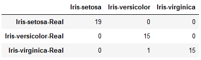

# KNN Algorithm
Implementation of k nearest neighbour algorithm for classification using Iris Dataset.

## Dataset Description
The Iris dataset can be found on the UCI Machine Learning Repository. It includes three iris species (Iris-setosa, Iris-versicolor and Iris-virginica) with 50 samples each as well as some properties about each flower.

The columns in this dataset are:
* Id
* SepalLengthCm
* SepalWidthCm
* PetalLengthCm
* PetalWidthCm
* Species

## Results
One third of dataset (50 samples) are used for testing purpose and model predicted with 98% test accuracy.
#### Confusion Matrix

